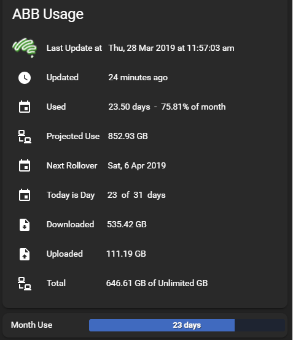

# ABB-Home-Assistant-Usage
Usage meter for Home Assistant

See the ABB Usage Meter Instructions for Home Assistant PDF file for iinstructions on how to use this repo. When the meter is added you can display usage on a lovelace card in Home Assistant.

Pre-requisites
1.	Needs to be running on a linux distribution (including HassOS).
2.	The usage retrieval uses a bash script to retrieve the usage json file from Aussie Broadband. This then creates a sensor abb_usage.
3.  You need to run the abbcreds.sh script first. This stores all your logon information in a file, abbcreds.json; Creates an abbcookie.txt valid for 12 months; creates the abbtoken.json which is a refresh token that is used to refresh the cookie 100 days before it expires. (Cookies are valid for 1 year). This stops us hammering the ABB API unnecessarily.
4.  This script can be in a sub-directory and *should* be aware of it's location and expects the data files above in the same directory as the script.
5.  This script should work with any Home Assistant Installation... Hassbian, Hassio etc...
6.  The abbcreds.sh will give you a 'hint' as to the value you entered the last time you ran the script. If that is unchanged, just press [Enter] otherwise EDIT the correct details in. You WILL need to rerun this script if you change your password!
7.	Your Home Assistant installation needs to have along term access token
8.	The Lovelace cards I supply require 2 custom cards.
config-template-card and bar-card available here:

https://github.com/custom-cards/config-template-card

https://github.com/custom-cards/bar-card

 
