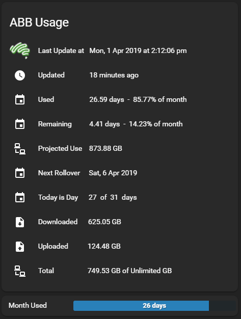

# ABB-Home-Assistant-Usage
Usage meter for Home Assistant

See the ABB Usage Meter Instructions for Home Assistant PDF file for iinstructions on how to use this repo. When the meter is added you can display usage on a lovelace card in Home Assistant.

Pre-requisites
1.	Needs to be running on a ‘regular’ linux distribution (not HassOS). This is because of number 2 below.
2.	The usage retrieval uses a bash script to retrieve the usage json file from Aussie Broadband. This then requires the Linux package mosquito-clients installed to publish the JSON data to a Mosquitto broker.

sudo apt-get install mosquito-tools 

Should install the package.

3.	Your Home Assistant installation needs to have an Mosquitto Broker running and you need to supply the username, password and IP address in the script. It also assumes the default port 1883 which you can change in the script in the setup options.
4.	The Lovelace cards I supply require 2 custom cards.
config-template-card and bar-card available here:

https://github.com/custom-cards/config-template-card

https://github.com/custom-cards/bar-card

